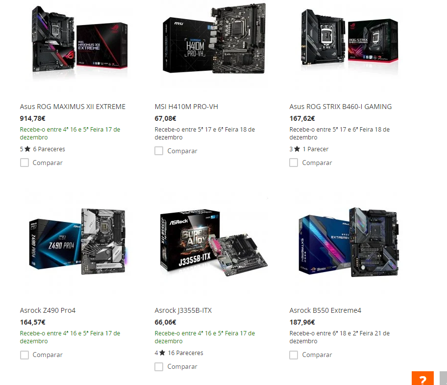
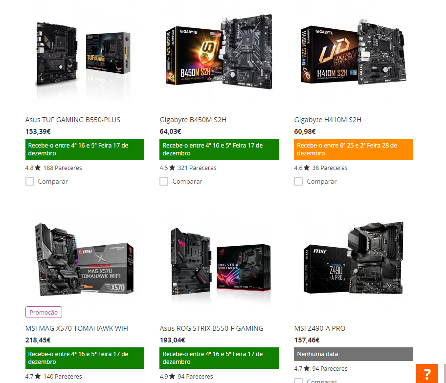

# PcComponentes Stock Visibility Enhancer

During my quest to search for a 3060ti in stock through several websites, I found out that PcComponentes it's not great at being able to tell if an item is in stock or not.
So I've written this in order to be easier to glance through the page and check for stock availability.

- Before

 

- After

 

# How to use

To use this, open [chrome://extensions/](chrome://extensions/) on Google Chrome, on the top right corner enable _developer mode_ then click the _Load Unpacked_ button and select the extension folder. 